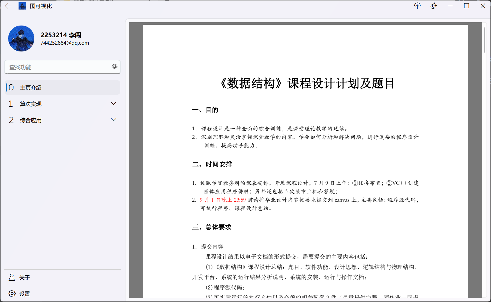
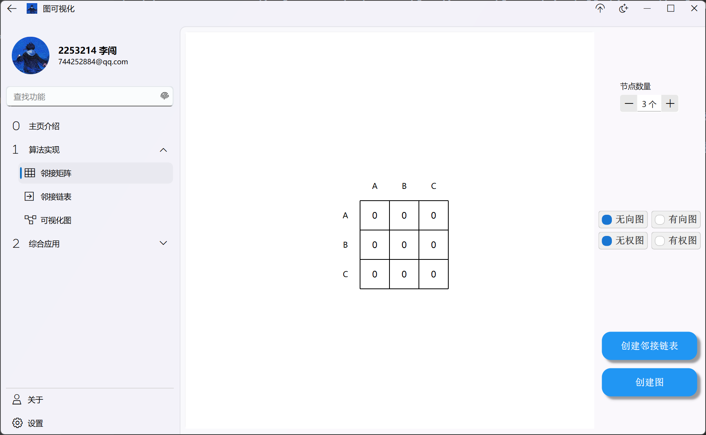
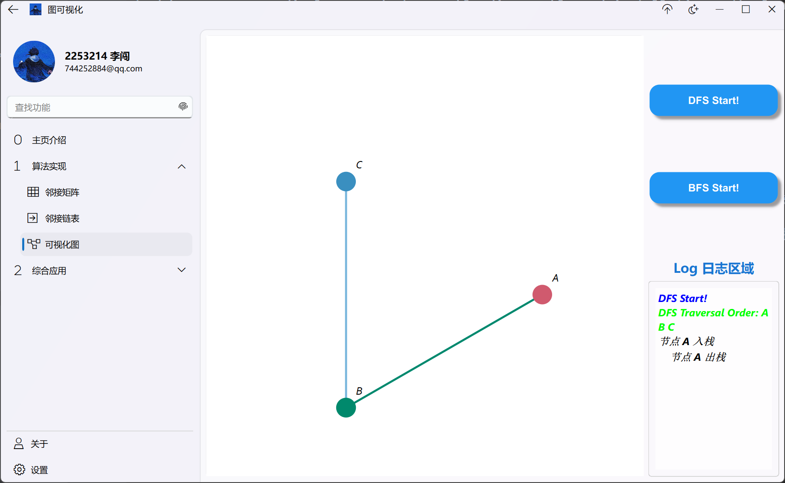
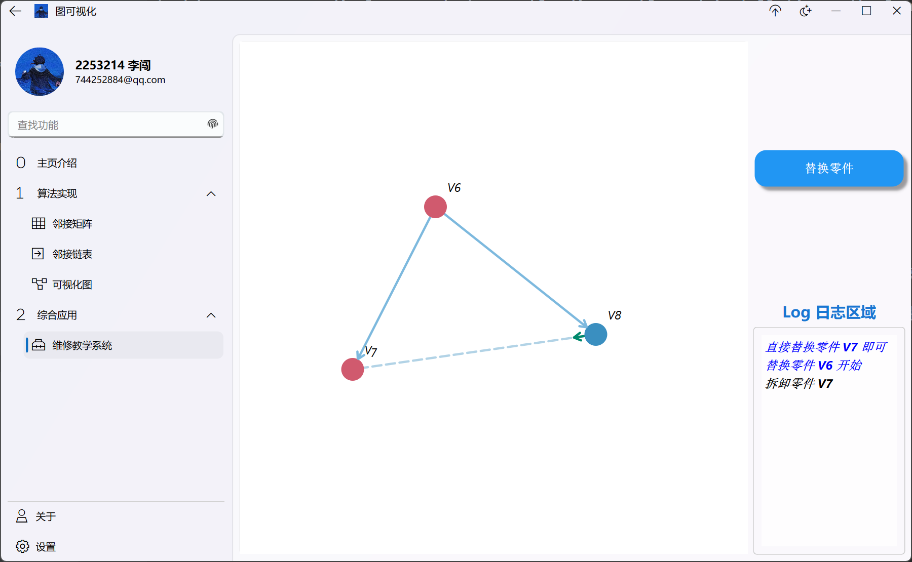
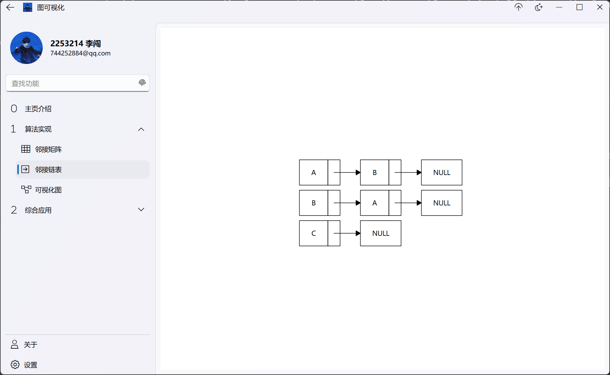

# data-structures-course-design-project

Data Structures course design, implement graph traversal (DFS recursive/non-recursive, BFS) with stack/queue process display, product assembly disassembly and installation path planning | 数据结构课程设计，实现邻接矩阵建图及邻接链表转换、图的深度 / 广度优先遍历、产品装配拆解与安装路径规划

## 📚 项目概述

本仓库为**数据结构课程设计**的完整实现项目，包含两个核心设计题目并完成全部功能开发：

1. 基于邻接矩阵构建无向/有向图，完成邻接矩阵到邻接链表的转换与显示；实现图的深度优先遍历（递归+非递归两种方式）、广度优先遍历，遍历过程中实时显示栈的入栈/出栈、队列的入队/出队详细情况。
2. 基于栈与队列的核心思想，实现**产品装配拆解与安装路径规划算法**，可自定义产品的零部件装配路径，指定需要替换的零部件后，自动规划出精准的拆解路径与逆向安装路径，完美贴合工业产品维修的实际应用场景。
